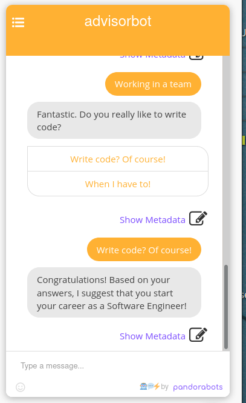

# advisorbot

Contains the files for advisorbot

## Summary

This project is related to the Task 1 for the Introduction to Artificial Intelligence course (C951).

The chatbot will interact with individual students, help them identify their strengths and preferences, and help them decide which career options to consider.

## Sample

You can upload this source into the Pandorabots platform dashboard to get something like this:

